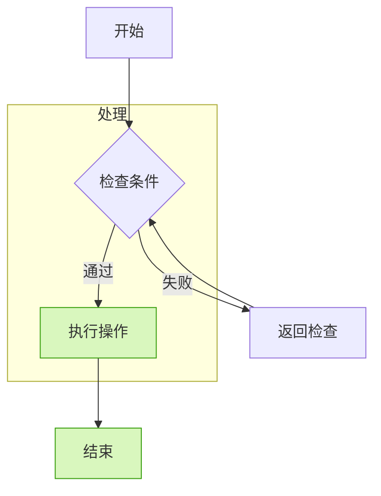

# 离线图表验证

```mermaid
flowchart TD
    A[开始] --> B{检查条件}
    B -->|通过| C[执行操作]
    B -->|失败| D[返回检查]
    C --> E[结束]
    D --> B
    subgraph 处理
      B
      C
    end
    classDef success fill:#d9f7be,stroke:#389e0d
    class C,E success
```

# SVG 流程图

